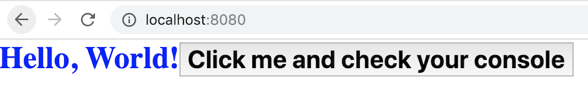

Percy
=====

[](https://circleci.com/gh/chinedufn/percy)

> A modular toolkit for building interactive frontend browser apps with Rust + WebAssembly. Supports server side rendering.

## [The Percy Book](https://chinedufn.github.io/percy/)

[The Percy Book](https://chinedufn.github.io/percy/)

---

## What is an isomorphic web app?

An isomorphic web application allows the same application code (in our case Rust code) to be run on both the server-side and the client-side (usually a web browser).

So the server would render the application into a `String` of HTML and send that down to the client.

Then the client would take over, re-rendering the application to a DOM `Node` whenever application state changes.

In a browser our application renders to an `HtmlElement`, and on the server our application renders to a `String`.

## API Documentation

- [virtual-dom-rs API docs](https://chinedufn.github.io/percy/api/virtual_dom_rs/macro.html.html)

- [html-macro API docs](https://chinedufn.github.io/percy/api/html_rs_macro)

- [css-rs-macro API docs](https://chinedufn.github.io/percy/api/css_rs_macro)

- [router-rs-macro API docs](https://chinedufn.github.io/percy/api/router_rs_macro)


## Getting Started

For a full example of an isomorphic web app in Rust check out the [isomorphic example](examples/isomorphic).

---

The best way to get up to speed is by checking out [The Percy Book](https://chinedufn.github.io/percy/), but here are some
very basic examples to get your feet wet with.

### Client Side Rendering

You can create applications that only have server side rendering, client side rendering, or both!

Here's a quick-and-easy working example of client side rendering that you can try right now!

---

First, Create a new project using

```
cargo new client-side-web-app --lib
cd client-side-web-app
```

Add the following files to your project. Here's the end directory structure:

```sh
.
├── Cargo.toml
├── build.sh
├── index.html
└── src
    └── lib.rs
```

Now edit each file with the following contents:

```sh
# contents of build.sh

#!/bin/bash

cd "$(dirname "$0")"

mkdir -p public

CSS_FILE="$(pwd)/public/app.css"
OUTPUT_CSS=$CSS_FILE wasm-pack build --no-typescript --dev --target no-modules --out-dir ./public
cp index.html public/
```

```rust
// contents of src/lib.rs

#![feature(proc_macro_hygiene)]

use wasm_bindgen::prelude::*;
use web_sys;

use css_rs_macro::css;
use virtual_dom_rs::prelude::*;

#[wasm_bindgen(start)]
pub fn start() {
    let start_view = html! { <div> Hello </div> };

    let window = web_sys::window().unwrap();
    let document = window.document().unwrap();
    let body = document.body().unwrap();

    let mut dom_updater = DomUpdater::new_append_to_mount(start_view, &body);

    let greetings = "Hello, World!";

    let end_view = html! {
       <div class="big blue">
          <strong>{ greetings }</strong>

          <button
            class=MY_COMPONENT_CSS
            onclick=|_event: web_sys::MouseEvent| {
               web_sys::console::log_1(&"Button Clicked!".into());
            }
          >
            Click me and check your console
          </button>
       </div>
    };

    dom_updater.update(end_view);
}

static MY_COMPONENT_CSS: &'static str = css!{r#"
:host {
    font-size: 24px;
    font-weight: bold;
}
"#};

static _MORE_CSS: &'static str = css!{r#"
.big {
  font-size: 30px;
}

.blue {
  color: blue;
}
"#};
```

```toml
# contents of Cargo.toml

[package]
name = "browser"
version = "0.1.0"
authors = ["Friends of Percy"]
edition = "2018"

[lib]
crate-type = ["cdylib"] # Don't forget this!

[dependencies]
wasm-bindgen = "0.2.37"
js-sys = "0.3.14"
virtual-dom-rs = "0.6"
css-rs-macro = "0.1"

[dependencies.web-sys]
version = "0.3"
features = [
    "Document",
    "MouseEvent",
    "Window",
    "console"
]
```

```html
<!-- contents of index.html -->
<!DOCTYPE html>
<html lang="en">
    <head>
        <meta charset="UTF-8">
        <meta name="viewport" content="width=device-width, initial-scale=1">
        <link rel="stylesheet" type="text/css" href="app.css"/>
        <title>Client Side Demo</title>
    </head>
    <body style='margin: 0; padding: 0; width: 100%; height: 100%;'>
        <script src='/browser.js'></script>
        <script>
            window.wasm_bindgen(`/browser_bg.wasm`).then(() => {})
        </script>
    </body>
</html>
```

Now run

```sh
cargo install wasm-pack

# Or any other static file server that supports the application/wasm mime type
npm install -g http-server

chmod +x ./build.sh
./build.sh

# Visit localhost:8080 in your browser
http-server public --open
```

And you should see the following:



Nice work!

## More Examples

- [Isomorphic web app](examples/isomorphic)

- [CSS in Rust](examples/css-in-rust)

- [Unit Testing View Components](examples/unit-testing-components)

- [Open an Issue or PR if you have an idea for a useful example!](https://github.com/chinedufn/percy/issues)

## Contributing

Always feel very free to open issues and PRs with any questions / thoughts that you have!

Even if it feels basic or simple - if there's a question on your mind that you can't quickly answer yourself then that's a failure
in the documentation.

Much more information on how to contribute to the codebase can be found in the [contributing section](https://chinedufn.github.io/percy/contributing/getting-started.html) of The Percy Book!

## To Test

To run all of the unit, integration and browser tests, [grab the dependencies then](https://chinedufn.github.io/percy/contributing/getting-started.html) :

```sh
./test.sh
```

## See Also

- [virtual-dom](https://github.com/Matt-Esch/virtual-dom) - a JavaScript virtual-dom implementation that I took inspiration from.

- [How to write your own Virtual DOM](https://medium.com/@deathmood/how-to-write-your-own-virtual-dom-ee74acc13060) - helped me better understand how a virtual-dom works.

- [Sheetify](https://github.com/stackcss/sheetify) inspired the css! macro

## License

MIT
